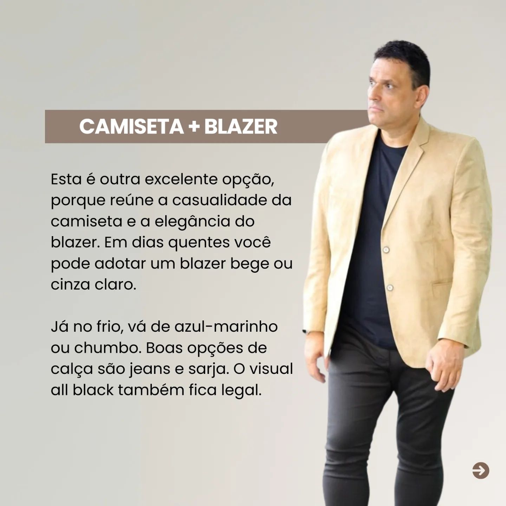

<!DOCTYPE html>
<html lang="pt-BR">

<head>
    <meta charset="UTF-8">
    <meta name="viewport" content="width=device-width, initial-scale=1.0">
    <title>Claudio Almeida - Moda Masculina</title>
    <link rel="stylesheet" href="style.css">
    <link rel="stylesheet" href="java.js">
    <link href="https://fonts.googleapis.com/css2?family=Mea+Culpa&display=swap" rel="style.css">

</head>

<body>

    <header>

        <h1>Claudio Almeida</h1>

        <nav>
            <ul class="UL">

                <ul>
                    <li><a href="#home" class="menu-link">Início</a></li>
                    <li><a href="#Produtos" class="menu-link">Produtos</a></li>
                    <li><a href="#sobre" class="menu-link">Sobre</a></li>
                    <li><a href="#contato" class="menu-link">Contato</a></li>
                </ul>

            </ul>

        </nav>

        <nav class="navbar">
            <ul class="menu">

                <li class="menu-item">
                    <a href="#">Camisetas</a>
                </li>
                <li class="menu-item">
                    <a href="#">Blazer</a>
                    <ul class="submenu">
                        <li><a href="#">Marca 1</a></li>
                        <li><a href="#">Marca 2</a></li>
                        <li><a href="#">Marca 3</a></li>
                        <li><a href="#">Marca 4</a></li>
                    </ul>
                </li>
                <li class="menu-item">
                    <a href="#">Camisetas</a>
                    <ul class="submenu">
                        <li><a href="#">Produto 1</a></li>
                        <li><a href="#">Produto 2</a></li>
                        <li><a href="#">Produto 3</a></li>
                    </ul>
                </li>
                <li class="menu-item">
                    <a href="#">Ternos</a>
                    <ul class="submenu">
                        <li><a href="#">Desconto 1</a></li>
                        <li><a href="#">Desconto 2</a></li>
                    </ul>
                </li>
                <li class="menu-item">
                    <a href="#">Looks</a>
                </li>
            </ul>
        </nav>

        

            <form action="#" method="get">
                

                    <input type="text" name="search" placeholder="Buscar...">

                    
  

                

            </form>
        

    </header>

    <section class="js-adbar section-adbar section-adbar-animated section-adbar-colors adbar-with-messages">
        

            

                
                    <a href="https://wa.me/5511992426616">PRÉ BLACK FRIDAY GARBO - ATÉ 40% OFF</a>
                
                
                    <a href="https://wa.me/5511992426616">FALE CONOSCO PELO WHATS</a>
                
                
                    <a href="https://wa.me/5511992426616">PRÉ BLACK FRIDAY GARBO - ATÉ 40% OFF</a>
                
                
                    <a href="https://wa.me/5511992426616">FALE CONOSCO PELO WHATS</a>
                
                <!-- Adicione mais mensagens conforme necessário -->
            

        

    </section>
    <section>
        

            

                
                
                
            

            

                <button class="prev">←</button>
                <button class="next">→</button>
            

            

                
                
                
            

        

    </Section>

    </Section>

    <section class="sec-2">

        <h2>BLACK FRIDAY</h2>
        
PROMOÇAO IMPERDIVEL

        

            

                

                    
                

                

                    
                

                

                    
                

            

            <button class="prev" onclick="moveSlide(-1)">&#10094;</button>
            <button class="next" onclick="moveSlide(1)">&#10095;</button>
        

        

    </section>

    <section class="sec-3">
        <h2>Conheça Nossa Loja</h2>

        

            <video width="800" autoplay loop muted>
                <source
                    src="Snapinsta.app_video_AQOORdKz_jWQ4leCtMaCP8swE2r-xv81vAEWVaLcch7G1nn7X5LelIXhJN0QKtwpBAqqtXC3E4Z3KcwAp2uREGck.mp4"
                    type="video/mp4">
                <source src="videos/nomedovideo.webm" type="video/webm">
                <source src="videos/nomedovideo.ogv" type="video/ogg">
                Seu navegador não suporta a tag de vídeo.
            </video>
        

    </section>

    <section class="sec-4">
        <h2 class="Produtos">Produtos</h2>

        
        
        
        
        
        
        
        
        
        
        
    </section>

    <section class="sec-5">
        <h2>Looks</h2>

        
        
        
        
        
        
        
        
        
        
        

    </section>

</body>

</html>

<main>
    <section id="home">
        <h2>Bem-vindo à Claudio Almeida</h2>
        
Moda masculina de alta qualidade.

    </section>

    </section>

    <section id="sobre">
        <h2>Sobre Nós</h2>
        
Conheça nossa história e missão.

    </section>

    <section id="contato">
        <h2>Contato</h2>
        
Entre em contato conosco!

        
Entre em contato conosco!

        
Entre em contato conosco!

        

            
            
            
            
            
        

    </section>
    <!-- START Widget WhastApp hospedagemwordpresspro -->

</main>

<!-- Alerta de notificação -->

    1 

<!-- Caixa de mensagem que aparece após alguns segundos -->

    Olá, como podemos ajudar?

<footer>
    
&copy; 2024 Claudio Almeida. Todos os direitos reservados.

    
R. Olegário Maciel, 332 - Centro, Patos de Minas - MG, 38700-543

    <a class="WhatsApp"
        href="https://api.whatsapp.com/send?phone=55NUMEROTELEFONE&text=Olá, preciso de mais informações!"
        id="waurlsite" class="bt-whatsApp" target="_blank"
        style="right:25px; position:fixed;width:60px;height:60px;bottom:40px;z-index:100;">

</footer>

</body>

</html>
@import url('https://fonts.googleapis.com/css2?family=Mea+Culpa&family=Petit+Formal+Script&family=Pinyon+Script&display=swap');

h1{
  
    font-family: "Pinyon Script", cursive;    
}

body {

    margin: 0;
    padding: 0;
 

}
.pinyon-script-regular {
    font-family: "Pinyon Script", cursive;
    font-weight: 400;
    font-style: normal;
  }
  
.mea-culpa-regular {
    font-family: "Mea Culpa", cursive;
    font-weight: 400;
    font-style: normal;
}

.petit-formal-script-regular {
    font-family: "Petit Formal Script", serif;
    font-weight: 400;
    font-style: normal;
}

header {
    background: #ffffff;
    color: #000000;
    padding: 10px 0;
    text-align: center;
    
}

nav ul {
    list-style: none;
    padding: 0;
}

nav ul li {
    display: inline;
    margin: 0 15px;
}

nav ul li a {
    color: #fff;
    text-decoration: none;
}

main {
    padding: 20px;
}

footer {
    text-align: center;
    padding: 20px;
    background: #000000;
    color: #fff;
    position: relative;
    bottom: 0;
    width: 100%;
}

.search-container form {
    display: flex;
    align-items: center;
    margin-left: 800px;
    border: none;
}

.search-container input {
    padding: 8px;
    font-size: 14px;
    border: none;
    border-radius: 9px;
    border: 2px solid #000000;
    padding: 12px 12px;
    margin-top: -130px;
}

.search-container button {
    padding: 8px 12px;
    background-color: #007BFF;
    border: none;
    color: white;
    font-size: 14px;
    border-radius: 4px;
    cursor: pointer;

}

.search-container button:hover {
    background-color: #0056b3;
}

.search-container {}

.menu-link {
    text-decoration: none;
    color: rgb(0, 0, 0);
    font-size: 16px;
    padding: 10px;
}

.menu-link:hover {
    color: #000000;
}

.Lupa {
    max-width: 50px;
    margin-top: -120px;
}

.js-adbar-animated {
    overflow: hidden;
    width: 100%;
    background-color: #000000;
}

.js-adbar-text-container {
    display: flex;
    animation: marquee 20s linear infinite;
}

.adbar-message {
    margin-right: 50px;
    font-size: 16px;
    background-color: #000000;
}

.adbar-message a {
    text-decoration: none;
    background-color: black;
    color: #ffffff;
    font-weight: bold;
}

.adbar-message a:hover {
    color: #0056b3;
    background-color: #000000;
}

@keyframes marquee {
    0% {
        transform: translateX(100%);
    }

    100% {
        transform: translateX(-100%);
    }
}

.menu {
    display: flex;
    list-style: none;
}

.menu-item {
    position: relative;
    margin: 0 20px;
}

.menu-item a {
    color: rgb(0, 0, 0);
    text-decoration: none;
    padding: 10px 15px;
    display: block;
}

.submenu {
    z-index: 10;
    position: absolute;
    top: 100%;
    left: 0;
    background-color: #ffffff;
    padding: 50px;
    list-style: none;
    min-width: 200px;
    display: none;

}

.submenu li a {
    color: rgb(0, 0, 0);
    padding: 10px;
    text-decoration: none;
    display: block;

}

.submenu li a:hover {
    text-shadow: rgb(0, 0, 0) 1px 1px 1px;

}

/* Animação de deslizamento */
.menu-item:hover .submenu {
    display: block;
    animation: slideIn 0.3s ease-out;
}

@keyframes slideIn {
    from {
        opacity: 0;
        transform: translateY(-10px);
    }

    to {
        opacity: 1;
        transform: translateY(0);
    }
}

.menu {
    margin-top: 70px;
    margin-left: 60px;
}

.UL {
    margin-top: 50px;
}

.carrinhocompras {
    max-width: 50px;
    margin-left: 84px;
    margin-top: -550px;
}

.Pessoa {
    max-width: 50px;
    margin-left: 2px;
    margin-top: -140px;
}

.Compras {
    max-width: 50px;
    margin-left: 2px;
    margin-top: -220px;
}

.CarriCompra {
    margin-top: -18px;
    margin-left: 30px;
}

.Procurar {
    margin-top: -54px;
}

.Lupabaixo {
    margin-top: 20px;
    margin-left: 250px;
}

/* Estilos para os botões de navegação */

/* Slideshow container */
.slideshow-container {
    max-width: 1000px;
    position: relative;
    margin: auto;
}

/* Hide the images by default */
.mySlides {
    display: none;
}

/* Next & previous buttons */
.prev,
.next {

    cursor: pointer;
    display: relative;
    top: 50%;

    padding: 16px;
    color: white;
    font-weight: bold;
    font-size: 18px;
    transition: 0.6s ease;
    border-radius: 0 3px 3px 0;
    user-select: none;
}

/* Position the "next button" to the right */
.next {
    right: 0;
    border-radius: 3px 0 0 3px;
}

/* On hover, add a black background color with a little bit see-through */
.prev:hover,
.next:hover {
    background-color: rgba(0, 0, 0, 0.8);
}

/* Caption text */
.text {
    color: #f2f2f2;
    font-size: 15px;
    padding: 8px 12px;
    position: absolute;
    bottom: 8px;
    width: 100%;
    text-align: center;
}

/* Number text (1/3 etc) */
.numbertext {
    color: #f2f2f2;
    font-size: 12px;
    padding: 8px 12px;
    position: absolute;
    top: 0;
}

/* The dots/bullets/indicators */
.dot {
    cursor: pointer;
    height: 15px;
    width: 15px;
    margin: 0 2px;
    background-color: #bbb;
    border-radius: 50%;
    display: inline-block;
    transition: background-color 0.6s ease;
}

.active,
.dot:hover {
    background-color: #717171;
}

/* Fading animation */
.fade {
    animation-name: fade;
    animation-duration: 1.5s;
}

@keyframes fade {
    from {
        opacity: .4
    }

    to {
        opacity: 1
    }
}

section {
    padding: 50px 20px;
    text-align: center;
}

.sec-1 {
    background-color: #ecf0f1;
}

.sec-2 {

    background-color: #c8c812;
    background-image: linear-gradient(147deg, #c8c812 0%, #FF2525 74%);

    color: rgb(0, 0, 0);
}

.sec-3 {
    background: url(Snapinsta.app_video_AQOORdKz_jWQ4leCtMaCP8swE2r-xv81vAEWVaLcch7G1nn7X5LelIXhJN0QKtwpBAqqtXC3E4Z3KcwAp2uREGck.mp4);
    background-size: cover;
    object-fit: cover;
    top: 0;
    left: 0;
    width: 100%;
    height: 100%;
    object-fit: cover;
    /* Faz com que o vídeo cubra toda a área */

    max-width: 100%;
    width: 100%;
    color: rgb(0, 0, 0);
}

.sec-4 {
    background-color: #27ae60;
    color: white;
}

.sec-5 {
    background-color: #ffffff;
    color: white;
}

.sec-4 {
    background-color: #ffffff;
    color: rgb(0, 0, 0);
}

.sec-5 {
    background-color: #ffffff;
    color: rgb(0, 0, 0);
}

.carrossel-container {
    position: relative;
    width: 80%;
    max-width: 800px;
    overflow: hidden;
    margin-left: 280px;
}

.carrossel {
    display: flex;
    transition: transform 0.5s ease;
}

.carrossel-item {
    min-width: 100%;
    max-width: 100%;
}

.carrossel-item img {
    width: 100%;
    height: auto;
}

button {
    position: absolute;
    top: 50%;
    transform: translateY(-50%);
    background-color: rgba(0, 0, 0, 0.5);
    color: white;
    border: none;
    padding: 10px;
    cursor: pointer;
    font-size: 20px;
}

button:hover {
    background-color: rgba(0, 0, 0, 0.8);
}

.prev {
    left: 0;
}

.next {
    right: 0;
}

.Video {

    top: 0;
    left: 0;
    width: 100%;
    height: 100%;
    object-fit: cover;
    /* Faz com que o vídeo cubra toda a área */
    background-size: cover;

    max-width: 100%;
    width: 100%;
}

.Estoque {}

.calcasarja {
    max-width: 20%;
    gap: 10px;
    display: flex;
    text-align: center;
    margin-top: 10px;
}

.camisablazer {
    max-width: 20%;
    gap: 10px;
    display: flex;
    text-align: center;
    margin-top: 10px;
}

.camisabranca {
    max-width: 20%;
    gap: 10px;
    text-align: center;
    margin-top: 10px;
}

.Produtos {
    color: black;
}

.calcasarja2 {
    max-width: 20%;
    gap: 10px;
    display: flex;
    text-align: center;
    margin-top: 10px;
}

.camisablazer2 {
    max-width: 20%;
    gap: 10px;
    display: flex;
    text-align: center;
    margin-top: 10px;
}

.camisabranca2 {
    max-width: 20%;
    gap: 10px;
    text-align: center;
    margin-top: 10px;
}

.bt-whatsApp {
    position: fixed;
    width: 60px;
    height: 60px;
    bottom: 40px;
    right: 25px;
    z-index: 100;

}

#alertWapp {
    position: fixed;
    right: 30px;
    visibility: hidden;
    bottom: 90px;
    background: red;
    z-index: 101;
    font-size: 11px;
    color: #fff;
    text-align: center;
    border-radius: 50%;
    font-weight: bold;
    line-height: normal;
}

#msg1 {
    position: fixed;
    visibility: hidden;
    right: 90px;
    bottom: 55px;
    background: #fff;
    color: #000;
    width: 100px;
    font-size: 12px;
    line-height: 13px;
    padding: 3px;
    border-radius: 10px;
    border: 1px solid #e2e2e2;
    box-shadow: 2px 2px 3px #999;
    z-index: 100;

}

@import url("https://fonts.googleapis.com/css2?family=Ubuntu+Mono&display=swap");

* {
    margin: 0;
    padding: 0;
    box-sizing: border-box;
}

.container {
    width: 100%;
    display: flex;
    justify-content: center;
    height: 500px;
    gap: 10px;

    >div {
        flex: 0 0 120px;
        border-radius: 0.5rem;
        transition: 0.5s ease-in-out;
        cursor: pointer;
        box-shadow: 1px 5px 15px #1e0e3e;
        position: relative;
        overflow: hidden;

        &:nth-of-type(1) {
            background: url("images.jpg") no-repeat 50% / cover;

        }

        &:nth-of-type(2) {
            background: url("images\ \(1\).jpg") no-repeat 50% / cover;
        }

        &:nth-of-type(3) {
            background: url("images\ \(2\).jpg") no-repeat 50% / cover;
        }

        &:nth-of-type(4) {
            background: url("camisa\,blazer.jpg") no-repeat 50% / cover;
        }

        .content {
            font-size: 1.5rem;
            color: #fff;
            display: flex;
            align-items: center;
            padding: 15px;
            opacity: 0;
            flex-direction: column;
            height: 100%;
            justify-content: flex-end;
            background: rgb(2, 2, 46);
            background: linear-gradient(0deg,
                    rgba(2, 2, 46, 0.6755077030812324) 0%,
                    rgba(255, 255, 255, 0) 100%);
            transform: translatey(100%);
            transition: opacity 0.5s ease-in-out, transform 0.5s 0.2s;
            visibility: hidden;

            span {
                display: block;
                margin-top: 5px;
                font-size: 1.2rem;
            }
        }

        &:hover {
            flex: 0 0 250px;
            box-shadow: 1px 3px 15px #7645d8;
            transform: translatey(-30px);
        }

        &:hover .content {
            opacity: 1;
            transform: translatey(0%);
            visibility: visible;
        }
    }
}

.social-icons {
    background-color: rgb(221, 224, 226);
}
* {
    margin: 0;
    padding: 0;
    box-sizing: border-box;
}

.carrossel-container {
    position: relative;
    width: 100%;
    max-width: 600px;
    margin: 0 auto;
    overflow: hidden;
    
}

.carrossel-slide {
    display: flex;
    transition: transform 0.5s ease;
}

.carrossel-slide img {
    width: 100%;
    height: auto;
    border-radius: 10px;
}

.navegacao-botoes {
    position: absolute;
    top: 50%;
    width: 100%;
    display: flex;
    justify-content: space-between;
    transform: translateY(-50%);
}

.prev, .next {
    background-color: rgba(0, 0, 0, 0.5);
    color: white;
    border: none;
    padding: 10px;
    cursor: pointer;
}

.prev:hover, .next:hover {
    background-color: rgba(0, 0, 0, 0.8);
}

.indicadores {
    position: absolute;
    bottom: 10px;
    left: 50%;
    transform: translateX(-50%);
    display: flex;
}

.indicador {
    width: 10px;
    height: 10px;
    margin: 0 5px;
    border-radius: 50%;
    background-color: rgba(255, 255, 255, 0.5);
    cursor: pointer;
}

.indicador.ativo {
    background-color: white;
}
